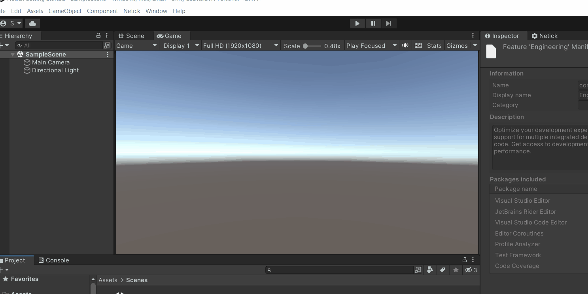

# 1 - Project Setup

## Step 1 - Verify Unity Prerequisites
Ensure that your Unity version aligns with the minimum specifications necessary to run Netick.
The minimum version required is Unity **2021** or later.

<figure><figcaption></figcaption></figure>

## Step 2 - Create a Blank Project
This tutorial we will choose the 3D (Built-in)

**Note:** Render pipeline doesn't affect Netick in whatsoever (unless you were using Netick samples which favors built-in render pipeline)

<figure><figcaption></figcaption></figure>

## Step 3 - Importing the Mono Cecil
Netick is dependent on the Mono Cecil. It helps Netick to inject several functionalities to your game code so you have to write less code.

Go to `Window > Package Manager > "+" Icon > Add package from git URL` and fill it with `com.unity.nuget.mono-cecil`
Reference: [https://docs.unity3d.com/Packages/com.unity.nuget.mono-cecil@1.11/manual/index.html](https://docs.unity3d.com/Packages/com.unity.nuget.mono-cecil@1.11/manual/index.html)

<figure><figcaption></figcaption></figure>

## Step 3 - Importing the Netick

Go to `Window > Package Manager > "+" Icon > Add package from git URL` and fill it with [https://github.com/karrarrahim/NetickForUnity.git](https://github.com/karrarrahim/NetickForUnity.git)

Awesome, the project is now setup and let's do some code!