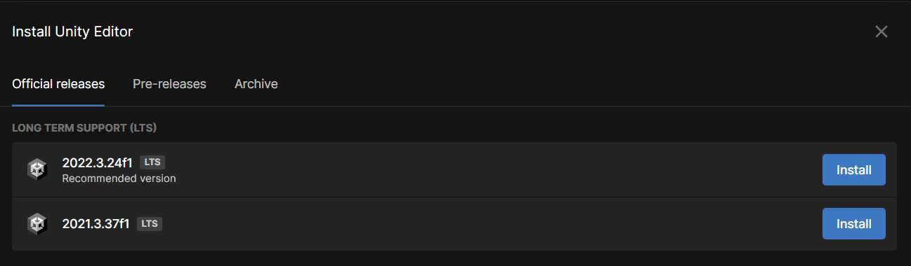
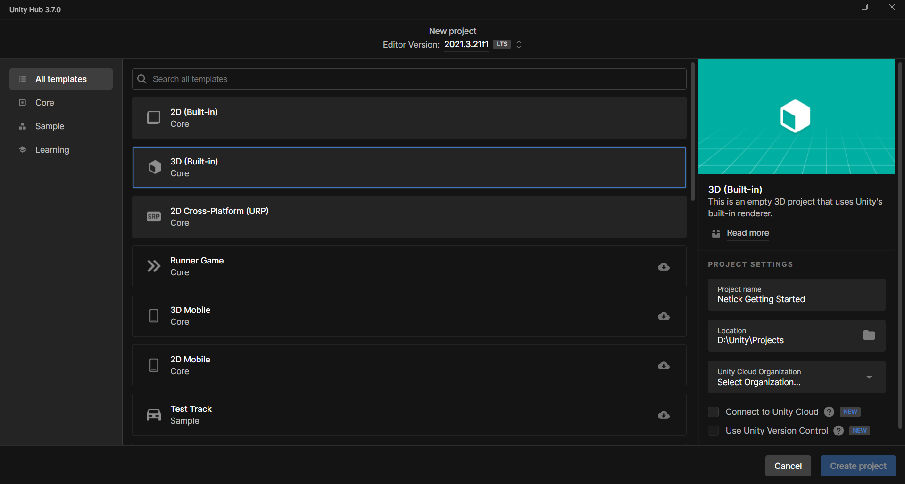

# 1 - Project Setup

## Step 1 - Unity Version
Make sure the version of Unity that you are using is **2021** or later.

<figure><figcaption></figcaption></figure>

## Step 2 - Create a Blank Project
In this tutorial, we will choose 3D (Built-in).

**Note:** Render pipeline doesn't affect Netick whatsoever (unless you were using Netick samples which use built-in render pipeline).

<figure><figcaption></figcaption></figure>

## Step 3 - Importing Netick

Go to `Window > Package Manager > "+" Icon > Add package from git URL` and fill it with [https://github.com/NetickNetworking/NetickForUnity.git](https://github.com/NetickNetworking/NetickForUnity.git)

Great, the project is now set, let's do some coding!