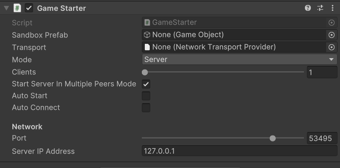
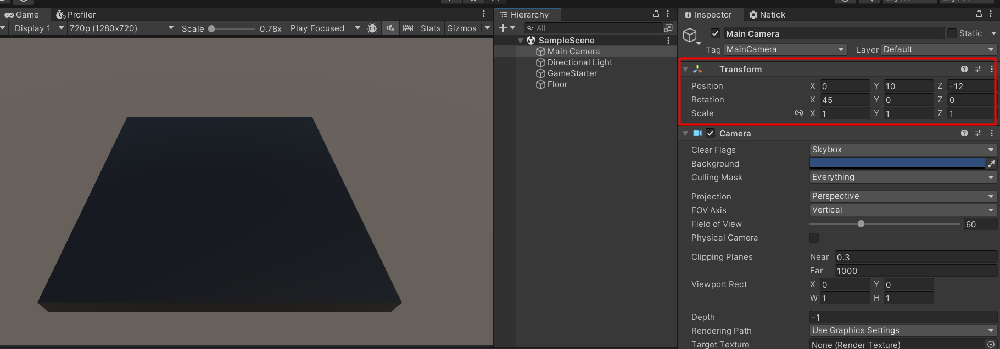
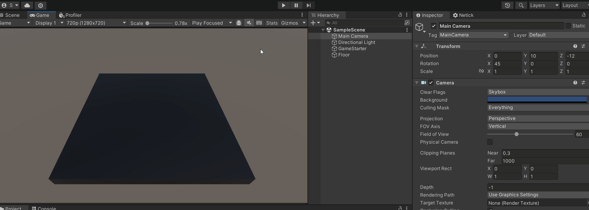

# 2 - Setting Up the Game

## Starting the Game
There are a few methods we can use to start the game:

```cs
// start the game as a server with a player
Netick.Unity.Network.StartAsHost(...);

// start the game as a client
var sandbox = Netick.Unity.Network.StartAsClient(...);

// connecting the client
sandbox.Connect(...);

// or just starting a server without a player (dedicated-server way)
Netick.Unity.Network.StartAsServer(...);

// or if we wanted to shut down Netick
Netick.Unity.Network.Shutdown();
```

[Learn More About Managing Netick](../managing-netick.md)

For quick testing, we can use the built-in `GameStarter` component, which will start the game for us.

1. Create a new empty GameObject.
2. Add the `GameStarter` Component.

After adding the component, there are several fields we need to take care of.

<figure><figcaption></figcaption></figure>

## Sandbox Prefab
The first field asks for a `Sandbox Prefab`

1. Create a new empty GameObject.
2. Rename it to `MySandboxPrefab` (or any name you like).
3. Save it as prefab in the Assets folder, and assign it in `Sandbox Prefab` of `GameStarter`.

> [!NOTE]
> Netick will automatically add a few other scripts too on this prefab when it's created which will happen when you start Netick, the most important one of those scripts is `NetworkSandox`. The Sandbox Prefab is a persistent GameObject, it will only be destroyed when you shut down Netick.

Any scripts you add to the Sandbox Prefab will stay around until you shut down Netick. Methods on `NetworkSandbox` (the script Netick adds to the Sandbox Prefab) lets you do various things like connecting, spawning objects and destroying them.

## Transport 
Now we need to assign a transport, Netick uses the LiteNetLib by default. To use this transport, we can right click on an empty place in the Assets folder and go to `Create > Netick > Transport > LiteNetLibTransportProvider`.
Then assign the `Transport` field of Game Starter.

<figure><figcaption></figcaption></figure>

## Setting Up the Scene
### Floor
- Let's create a 3D Cube named "Floor" with a scale of `(15, 1, 15)` and a position of `(0, -1.5, 0)`.
- Create and assign a black material into it for visibility
<figure><figcaption></figcaption></figure>

### Camera
Modify the camera's position to `(0, 10, -12)` and adjust its rotation to `(45, 0, 0)`.

<figure><figcaption></figcaption></figure>

## Gameplay Manager
Let's create our manager script to handle gameplay aspects such as spawning the player character when a certain player joins.

Create a C# script named `GameplayManager`, then add it to the GameStarter GameObject.

This script will inherit from `NetworkEventsListener`. By doing this, `GameplayManager` now has the ability to listen to important network events such as when a player connects, disconnects, etc.

[Learn More About Listening to Network Events](../listening-to-network-events.md)

```cs
using Netick;
using Netick.Unity;

// Change parent class from MonoBehaviour to NetworkEventsListener
public class GameplayManager : NetworkEventsListener
{
    
}
```

## Player Character
Let's create our player character:
1. Right click on the hierarchy and select `3D Object > Capsule`.
2. Add `NetworkObject` component.
3. Rename it to `PlayerCharacter`.
4. Remove the Capsule Collider from the Capsule we just created (we won't use physics in this tutorial)

Adding `NetworkObject` to a GameObject will give it an identity across the network, so that it's synced. 

## Spawning our Player
1. Add a field to hold the player character prefab in our gameplay manager script and give it type of `NetworkObject`.
2. Then, let's also spawn the character when a player connects to the server.

#### Input Source
On the `NetworkInstantiate`, you can pass an Input Source. 
Input Source represents which peer has the authority to send inputs to this object, in this case that player is the joining player.

3. Don't forget to assign the player prefab on the `GameplayManger` script!

```cs
using Netick;

public class GameplayManager : NetworkEventsListener
{
    public NetworkObject PlayerPrefab;

    public override void OnPlayerConnected(NetworkSandbox sandbox, Netick.NetworkPlayer player)
    {
        // Random Spawn Position (to not make them overlap)
        Vector3 spawnPosition = new Vector3();
        spawnPosition.x = Random.Range(-5f, 5f);
        spawnPosition.z = Random.Range(-5f, 5f);

        sandbox.NetworkInstantiate(PlayerPrefab.gameObject, spawnPosition, Quaternion.identity, player);
    }
}
```

> [!Note]
> Unity has old methods from the time when UNet was still around, sometimes providing incorrect signature information for `OnPlayerConnected` in your IDE, for instance. This issue is harmless and can be ignored.

## Testing

Let's go ahead and enter play mode. You can see our player spawning by clicking on "Start Host".

<figure><figcaption></figcaption></figure>