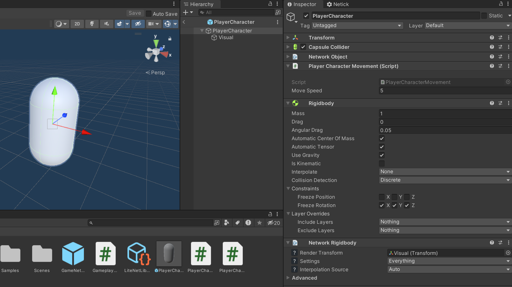
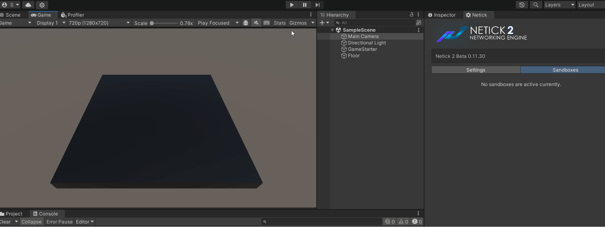

# 3 - Player Character Movement

Since Netick is a server-authoritative networking solution, we can't directly move the player character object (in a client-auth fashion) on the client for security reasons. Instead, we use inputs, which will be used to move our player. To move the player based on our input, here's how it works: we send an input to the server, the server fetches our input, and then uses it to move our character. Netick uses something called Client-Side Prediction to make this process responsive.

[Learn More About Client-Side Prediction](../understanding-client-side-prediction/understanding-client-side-prediction.md)

## Input Struct
Consider the type of player inputs required for our gameplay. In this tutorial, we only use a vector for movement direction.

1. Create a C# script and call it `PlayerCharacterInput`.
2. Change the type into `struct` from `class`.
3. Make sure to implement `INetworkInput`.

This input will be sent to the server, and can be processed later on.

```cs
using Netick;

public struct PlayerCharacterInput : INetworkInput
{
    public Vector2 Movement;    
}
```

## Setting and Sending Input
There are a few places to set your input. The preferred way is on `OnInput` on `NetworkEventsListener`.

1. Modify the `GameplayManager` script.
2. Override the `OnInput` method.
3. Use `sandbox.SetInput` to set your input.

```cs
using Netick;
using Netick.Unity;
using UnityEngine;

public class GameplayManager : NetworkEventsListener
{
    // ...   
    public override void OnInput(NetworkSandbox sandbox)
    {
        PlayerCharacterInput input = sandbox.GetInput<PlayerCharacterInput>();
        input.Movement             = new Vector2(Input.GetAxis("Horizontal"), Input.GetAxis("Vertical"));
        sandbox.SetInput(input);
    }
}

```

[Learn More About Inputs](../understanding-client-side-prediction/writing-client-side-prediction-code.md)

## Fetch Input

We use a method called `FetchInput` to try to fetch an input for the current tick. If we are able to fetch an input, we use it to drive the gameplay logic, such as the movement of our character. 

`FetchInput` must only be called inside `NetworkFixedUpdate`. To be able to use this method, let's create a new C# script named `PlayerCharacterMovement`, to handle our movement logic. Let's also change its parent class from `MonoBehaviour` to `NetworkBehaviour`.

We also need a `moveSpeed` variable, declare it using `float` type and set the default value to `5`.

[Learn More About Network Behaviour](../core-concepts.md#network-behaviour)

```cs
public class PlayerCharacterMovement : NetworkBehaviour
{
    public float moveSpeed = 5;

    public override void NetworkFixedUpdate()
    {
        if (FetchInput(out PlayerCharacterInput input))
        {
            Vector3 movement = new Vector3(input.Movement.x, 0, input.Movement.y);
            transform.position += movement * Sandbox.FixedDeltaTime * moveSpeed;
        }
    }
}
```

In a single-player game, we use `Time.deltaTime` to move our player to make it frame independent. With Netick, instead of using `Time.deltaTime`, we use `Sandbox.FixedDeltaTime`, which represents the time between two network ticks.

> [!Note]
> Do not confuse `Sandbox.FixedDeltaTime` with `Sandbox.DeltaTime` (equal to Unity's `Time.deltaTime`). 


[Learn More About Writing Client-Side Prediction Code](../understanding-client-side-prediction/writing-client-side-prediction-code.md)

## Network Transform
Adding `NetworkTransform` allows us to sync the position, rotation of our character.

- Add `NetworkTransform` component to our player character prefab.

[Learn More About NetworkTransform](../built-in-components/networktransform.md)

### Gameplay & Visual Seperation
In the `NetworkTransform` component, there is a `Render Transform` field which asks for a `Transform`.
Because Netick is a tick-based netcode, it means movement will happen at a fixed rate which is lower than your FPS. Which will cause unsmooth movement. To fix this, we use interpolation which lets us give smoothed position and rotation to our player character visual.

1. Create a child on the player and name it "Visual".
2. Delete & Move the `Capsule (Mesh Filter)` and `Mesh Renderer` component to Visual.
3. Assign Visual to `Render Transform` of `NetworkTransform` .

[Learn More About Interpolation](../interpolation.md)

Here's what our player character object looks like now:

<figure><figcaption></figcaption></figure>

## Multiplayer Testing
Let's try to run the game now. In Netick, there is something called Sandboxing (or multi-peer), that allows us to simulate multiple peers on a single Unity process, meaning we don't have to build the game (or use two editors) to test multiplayer. Instead, we run a server and a client (or multiple) together in the same project at the same time.

1. Enter play mode.
2. Click on `Run Host + Client`.
3. Click `Connect`.

You can show/hide sandboxes in `Netick > Sandboxes`.

[Learn More About Sandboxing](../sandboxing.md)

<figure><figcaption></figcaption></figure>