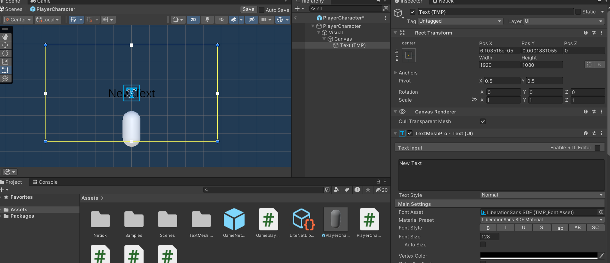
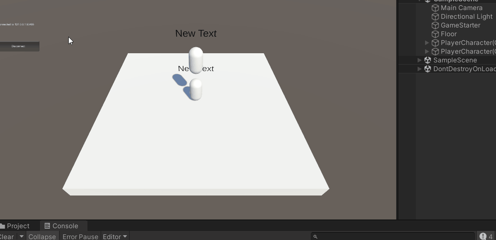

# 5 - Remote Procedure Call
In this tutorial, we are going to use an RPC (Remote Procedure Call) to set our nickname randomly. RPC is the most primitive way to sync things in the game. It's not recommended to use RPCs most of the time, and should only be used for infrequent actions like sending the player's name to the server.

[Learn More About RPCs](../remote-procedure-calls-rpcs.md)

## UI Setup

1. In PlayerCharacter prefab, on the `Visual` transform, add a `UI > Text - TextMeshPro`.
2. It might asks you to `Import TMP Essentials`, import it and close the window afterwards.
3. Change the `Canvas` `Render Mode` from `Screen Space - Overlay` to `World Space`.
4. Position your canvas to be 
    Pos X: `0`
    Pos Y: `2 `
5. Change the canvas scale to `0.005` for all axis.

<figure><figcaption></figcaption></figure>

6. In your text component, change font size to `128`, and middle & center alignment. Make sure your text now is in the center.

<figure><figcaption></figcaption></figure>

## PlayerCharacterNametag

1. Create a new script and name it `PlayerCharacterNametag`.
2. Change parent class to `NetworkBehaviour`.
3. Create a network property named Nickname and give it the type of `NetworkString32` (`string` works too, however you should always use NetworkString as `string` can't work as an RPC parameter or a struct field).

## RPC Implementation

We're going to set the RPC source to `InputSource` and the target to `Owner` (Server/Host). This means only the input source peer is able to call this RPC, but only the server will execute the RPC. We also want to set `isReliable` to true, this will ensure that this RPC will arrive to the server, even if packet loss occurs.

```cs
using UnityEngine;
using Netick;
using Netick.Unity;

public class PlayerCharacterNametag : NetworkBehaviour
{
    [Networked] public NetworkString32 Nickname { get; set; }

    [Rpc(source: RpcPeers.InputSource, target: RpcPeers.Owner, isReliable: true)]
    public void RPC_SetNicknameRandom()
    {
        Nickname = new NetworkString32($"Player_{Random.Range(1000, 9999)}");
    }
}
```

## Calling the RPC

RPCs can be called from any place. We're going to call them from inside `NetworkUpdate` (not to be confused with `NetworkFixedUpdate`) which is just a regular Unity `Update`.
We only want to call the RPC if we have the input authority and if we press the Enter keycode.

```cs
public class PlayerCharacterNametag : NetworkBehaviour
{
    //....

    public override void NetworkUpdate()
    {
        if (IsInputSource && Input.GetKeyDown(KeyCode.Return) && Sandbox.InputEnabled)
        {
            RPC_SetNicknameRandom();
        }
    }

    //...
}
```


## Nickname OnChanged
Then, we're going to use an OnChanged callback for our Nickname:

```cs
public class PlayerCharacterNametag : NetworkBehaviour
{
    //...
    public TMP_Text TextNametag;
    //...

    [OnChanged(nameof(Nickname))]
    private void OnNicknameChanged(OnChangedData onChangedData)
    {
        TextNametag.SetText(Nickname);
    }

    //...
}
```

Assign the TextNametag with the TextMeshPro UI we have created before.

## Final Testing

Let's press the Enter key repeatedly to check if the RPC is working.

<figure><figcaption></figcaption></figure>