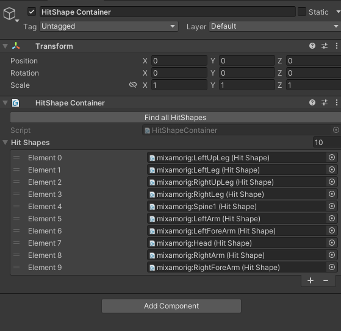
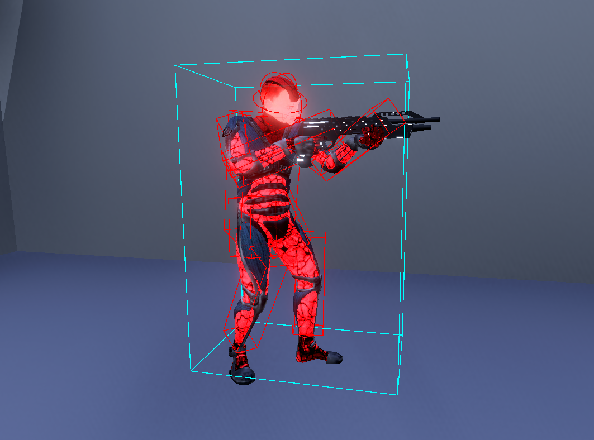

# Lag Compensation [Pro]

---

## Understanding the Need for Lag Compensation

Because every connected player has a different latency (ping), every player sees the world at a slightly different point in time than the server. When a client fires a weapon, the targets they were aiming at occupy *different* positions on the client than on the server at that same logical moment. Without compensation, accurate shots simply miss.

On the server, **everything is in the present**. On the client, **only the player-controlled character is in the present**; other players (proxies) live in the **remote snapshot timeline**, which is always in the past relative to the predicted snapshot timeline. (Netick's full-world prediction can put proxies in the predicted timeline too - if you do that, lag compensation isn't needed for those entities.)

**Lag Compensation** means rewinding the server's world to what the client was actually seeing at the moment they pressed the trigger, running the shot against *that* past view, and using the result authoritatively.

**Q:** Why not just let the client say "I hit X for Y damage"?
**A:** We can't trust the client. Authority over hit detection is non-negotiable for any competitive networked game. **Lag Compensation keeps that authority on the server** while still feeling responsive to the shooter.

> [!Video https://www.youtube.com/embed/6EwaW2iz4iA]

---

## How Netick's Lag Compensation Works

Each `HitShapeContainer` captures the world-space pose of all its child `HitShape`s into a per-tick snapshot ring buffer. Every query - whether it's a server-side rewound shot, a client-side predicted shot, or a query during client resimulation - resolves against an **interpolated pair** of snapshots: a `From` tick, a `To` tick, and an `Alpha` between them. The same `(From, To, Alpha)` triple the engine uses to drive visual interpolation is used for hit detection, so the world you query against is always the world the player is looking at.

### Supported Queries

| Query                                | Volume swept against world | Returns           |
| ------------------------------------ | -------------------------- | ----------------- |
| `Raycast` / `Raycast2D`              | A ray                      | Closest hit       |
| `RaycastAll` / `RaycastAll2D`        | A ray                      | Every hit         |
| `SphereCast`                         | A sphere swept along a ray | Closest hit       |
| `SphereCastAll`                      | A sphere swept along a ray | Every hit         |
| `OverlapSphere` / `OverlapCircle`    | A static sphere/circle     | Every overlap     |
| `HitShape.Raycast`                   | A ray against one shape    | Hit on that shape |

### Supported HitShape Types

| Type    | 
| ------- | 
| Box     | 
| Sphere  | 
| Capsule |


---

## Setup

### 1. Enable Lag Compensation in Netick Settings

`Netick Settings → Lag Compensation → Enable`

> [!WARNING]
> If Lag Compensation isn't enabled in settings, every query API will log an error and return no hit.

### 2. Place HitShapes on each moving part

Add a `HitShape` component on every bone or part of your character that can move and should be hittable.

<figure><figcaption><p>HitShape on each bone.</p></figcaption></figure>

For each shape, set:

- **Shape** - `Box`, `Sphere`, or `Capsule`.
- **Center** - local-space offset from the transform.
- **Size** / **Radius** / **Height** / **Axis** - geometry, per shape type.

> [!WARNING]
> HitShape transforms (and any parent transform up to the root) should have **lossy scale equal to (1, 1, 1)**. The capture path bypasses Unity's scale-aware `TransformPoint` for performance; non-uniform or non-identity scale on a parent will silently drift the captured pose from where Unity thinks the shape is. If you need scaled rigs, keep the scale on the visual mesh only, above the HitShape hierarchy.

### 3. Add a HitShape Container on the character root

Add a `HitShape Container` component to the root `GameObject` of your character. With the component selected, click **Find All HitShapes** in the inspector - this walks the entire transform hierarchy under the root and fills the container's `HitShapes` list with every `HitShape` it finds. Re-click it whenever you add, remove, or move HitShapes in the editor so the list stays in sync.

<figure><figcaption><p>HitShape Container on the root of the character.</p></figcaption></figure>

The recommended hierarchy:

```
> Root (with NetworkObject + HitShape Container)
    > Render Transform
        > Character Rig
            > Character Bone (with HitShape)
            > Character Bone (with HitShape)
            ...
```

---

## Performing Queries

Every lag-compensated query takes an **`inputSource`** parameter: pass the input source of the player whose action this query represents (the player firing the shot, throwing the grenade, swinging the melee, etc.). The server uses it to look up which `(From, To, Alpha)` to rewind to - the same one that player was visually interpolating when their input was produced. Passing the wrong source, or `null`, rewinds against the wrong timeline (or falls back to the local interpolation), and the result won't match what the acting player saw.

### Raycast

```csharp
if (Sandbox.Raycast(
        shootPos,
        shootDirection,
        out LagCompHit hit,
        inputSource: Object.InputSource,        // who is shooting
        maxDistance: Mathf.Infinity,
        layerMask: Physics.DefaultRaycastLayers,
        queryTriggerInteraction: QueryTriggerInteraction.Ignore,
        includeUnityColliders: true))
{
    if (hit.HitShape != null)
    {
        // We hit a Netick HitShape - apply damage, spawn FX, etc.
        var victim = hit.HitShape.Container.GetComponent<Health>();
        victim?.TakeDamage(...);
    }
    else
    {
        // We hit a Unity collider (geometry, prop, etc.).
    }
}
```

### SphereCast

```csharp
if (Sandbox.SphereCast(
        origin,
        radius: 0.25f,
        direction,
        out LagCompHit hit,
        inputSource: Object.InputSource,
        maxDistance: 30f))
{
    // ...
}
```

### OverlapSphere (explosions, AoE)

```csharp
var hits = new List<LagCompHit>(32);
Sandbox.OverlapSphere(
    blastCenter,
    blastRadius,
    hits,
    inputSource: Object.InputSource,
    queryTriggerInteraction: QueryTriggerInteraction.Ignore);

foreach (var h in hits)
    if (h.HitShape != null)
        h.HitShape.Container.GetComponent<Health>()?.TakeDamage(...);
```

### Per-shape Raycast

If you already know exactly which `HitShape` you want to test (e.g. a server-side re-validation of a client-reported hit), call `HitShape.Raycast` directly - it skips the broadphase entirely:

```csharp
if (suspectedShape.Raycast(origin, direction, out var hit, Object.InputSource))
    // confirmed
```

### All hits (penetrating shots, hitscan with falloff)

`Sandbox.RaycastAll`, `Sandbox.SphereCastAll`, and `Sandbox.OverlapSphere` all fill a `List<LagCompHit>` with every result. Pass `oneHitPerHitShapeContainer: true` if you want each character counted only once.

```csharp
var hits = new List<LagCompHit>(16);
Sandbox.RaycastAll(
    origin,
    direction,
    hits,
    inputSource: Object.InputSource,
    oneHitPerHitShapeContainer: true);
```

### Filtering candidates

For team-friendly fire, faction filters, or any custom skip rule, pass a `Predicate<LagCompFilterData>`:

```csharp
Sandbox.Raycast(
    origin, direction, out var hit, Object.InputSource,
    filter: data =>
    {
        // data.Candidate is the HitShapeContainer being tested;
        // data.Player is the input source's player id.
        var team = data.Candidate.GetComponent<Team>();
        return team == null || team.Id != myTeamId;   // skip teammates
    });
```

---

## Execution Order

This is the one thing that **must** be set correctly:

> [!WARNING]
> Any script that performs a lag-compensated query from `NetworkFixedUpdate` must run **after** `LagCompensationStep`. Order them with `[ExecuteAfter(typeof(LagCompensationStep))]`.

`LagCompensationStep` is what advances the snapshot ring buffer each fixed tick. Scripts that query before it has run won't match what's drawn on screen.

Animation and movement scripts that update transforms should also be ordered consistently so the lag-comp world stays in sync with the rendered pose:

```cs
public class Movement : NetworkBehaviour { /* ... */ }

[ExecuteAfter(typeof(Movement))]
public class Animation : NetworkBehaviour
{
    public override void NetworkFixedUpdate()
    {
        Animate(State, Sandbox.TickToTime(IsProxy ? Sandbox.AuthoritativeTick : Sandbox.Tick));
    }

    public override void NetworkRender()
    {
        Animate(state, IsProxy
            ? Sandbox.RemoteInterpolation.Time
            : Sandbox.LocalInterpolation.Time);
    }
}

[ExecuteAfter(typeof(LagCompensationStep))]
public class Weapon : NetworkBehaviour
{
    public override void NetworkFixedUpdate()
    {
        if (FetchInput(out GameInput input) && input.Shot)
        {
            if (Sandbox.Raycast(/* ... */, out var hit))
            {
                // ...
            }
        }
    }
}
```

`Movement` runs first → `Animation` advances bones to match → `LagCompensationStep` captures bone poses into the snapshot ring buffer → `Weapon` queries against the updated lag comp world.

---

## Animation

The lag-compensation system captures whatever pose the bones - and therefore the HitShapes parented to them - happen to be in at the moment of capture. For the server's rewound world to match what the shooting client actually saw, and for client-side predicted hits to agree with the server's authoritative result, **the animation must be ~deterministic from a synced game state and an explicit time value**. If the server and any remote client can disagree on where a bone sits at the same logical tick, every other layer of lag-comp correctness is undermined.

### Why Mecanim / the default Animator doesn't work

Unity's built-in `Animator` (Mecanim) is **not** deterministic in the way lag compensation needs:

- It accumulates time internally from `Time.deltaTime` on its own update schedule, not from an explicit time value you supply.
- It runs a stateful state machine with crossfades, transition timers, layer weights, and interrupts - none of which can be jumped to a specific tick or time from outside.
- There's no API to say "make the rig look exactly the way it should at time `t`".

The result is that at the same logical tick, the server and a remote client running the same Mecanim setup will produce subtly different bone poses. Subtle is enough - hit detection that's two centimeters off at the shoulder is what makes shots feel inaccurate.

> [!WARNING]
> Mixing a Mecanim-driven character with lag compensation will appear to *work* - queries return hits, no errors fire - but the hits will be misaligned with what the shooter saw.

### The fix: custom Playable-based animator

Use Unity's [Playable API](https://docs.unity3d.com/Manual/Playables.html) (specifically `AnimationPlayableGraph` / `AnimationClipPlayable` / `AnimationMixerPlayable`) to write a custom animator you fully control. Each clip playable lets you **set its time directly** with `SetTime(...)` and then evaluate the graph - so the resulting rig pose becomes a pure function of `(state, time)`. Same inputs on server and client, same bones, same HitShape capture, consistent lag compensation.

Drive your animator from a single `Animate(state, time)` method and feed it different `time` values depending on context:

| Context                                        | Time to pass                                    |
| ---------------------------------------------- | ----------------------------------------------- |
| `NetworkFixedUpdate`                           | `Sandbox.TickToTime(Sandbox.AuthoritativeTick)` |
| `NetworkRender` on the client for proxies      | `Sandbox.RemoteInterpolation.Time`              |
| `NetworkRender` on the client for local player | `Sandbox.LocalInterpolation.Time`               |
| `NetworkRender` on the server/host             | `Sandbox.LocalInterpolation.Time`               |

The fixed-update path is the one the lag-comp system captures from - that's how the captured pose matches the authoritative tick. The render-frame paths drive what's visually drawn, and because every lag-comp query also interpolates between the same authoritative snapshots with the same alpha, what the player sees and what the query hits stay in lockstep.

### `Animate(state, time)` - pseudocode

`state` is the high-level gameplay state your animation reads from - what the character is *doing* (idle, walking, sprinting, shooting, reloading...) plus the tick the action began on, and any continuous parameters that drive blends (velocity, aim direction, etc.). Because it's networked, the server and every client see the same `state` at the same tick - so the clip your animator selects and the time it samples are identical everywhere. Clip ids and clip times are *derived* from state and time, not part of state itself.

```csharp
void Animate(AnimationState state, float time)
{
    // 1) DERIVE which clip(s) to play from the synced gameplay state. Both
    //    server and client see the same `state` at the same tick, so they
    //    pick the same clip(s).
    var clip = state.Action switch
    {
        CharacterAction.Idle      => _idleClip,
        CharacterAction.Walking   => _walkClip,
        CharacterAction.Sprinting => _sprintClip,
        CharacterAction.Shooting  => _shootClip,
        CharacterAction.Reloading => _reloadClip,
        _                         => _idleClip,
    };

    // 2) Convert the global time into clip-local time using the tick this
    //    action started on (a synced value). No internal accumulators -
    //    pure function of (state, time).
    float elapsed  = time - Sandbox.TickToTime(state.ActionStartTick);
    float clipTime = clip.isLooping
        ? elapsed % clip.length
        : Mathf.Min(elapsed, clip.length);

    // 3) Sample the rig at `clipTime`. The Playable API's SetTime+Evaluate
    //    is what gives you exact, framerate-independent control - this is
    //    the part Mecanim can't do. Hand-wave it as one operation here:
    SamplePose(clip, clipTime);

    // (For blends, drive a mixer's input weights from `state` the same way -
    //  e.g. mix walk and sprint by state.Velocity.magnitude.)
}
```

### `Animation` script - pseudocode

```csharp
[ExecuteAfter(typeof(Movement))]
public class Animation : NetworkBehaviour
{
    [Networked, Smoothed] public AnimationState State { get; set; }   // synced gameplay state

    public override void NetworkFixedUpdate()
    {
        // Pose at the authoritative tick - LagCompensationStep (ordered after
        // this script) captures this pose into the snapshot ring.
        Animate(State, Sandbox.TickToTime(IsProxy ? Sandbox.AuthoritativeTick : Sandbox.Tick));
    }

    public override void NetworkRender()
    {
        // Pose actually drawn this frame. Lag-comp queries interpolate between
        // the same authoritative snapshots with the same alpha, so rendered
        // and queried poses stay in lockstep.
        float time = IsProxy
            ? Sandbox.RemoteInterpolation.Time
            : Sandbox.LocalInterpolation.Time;

        Animate(InterpolateState(IsProxy), time);
    }

    // See Animate pseudocode above - derive a clip from state.Action, derive
    // clip-local time from (time - Sandbox.TickToTime(state.ActionStartTick)),
    // and sample the rig via the Playable API.
    void Animate(AnimationState state, float time) { /* ... */ }

    // interpolate State using the interpolation API, see Interpolation doc article.
    AnimationState InterpolateState(bool isProxy) { /* ... */ }
}

// What the character is doing - the gameplay vocabulary the animation reads from.
public enum CharacterAction
{
    Idle, Walking, Sprinting, Jumping, Shooting, Reloading,
}

// Synced state the animator reads from. Networked, so the server and every
// client see the same value at the same tick - so Animate(state, time)
// produces the same rig pose everywhere.
public struct AnimationState 
{
    public CharacterAction Action;          // what the character is doing
    public Tick            ActionStartTick; // tick on which `Action` began
    public Vector3         Velocity;        // drives walk/sprint blends, direction-aware motion, etc.
    public NetworkBool     IsAiming;
    //...//
}
```

`NetworkFixedUpdate` runs once per tick on both server and client and produces the pose at the authoritative tick - which is exactly what `LagCompensationStep` will capture into the snapshot ring a moment later (because of the `[ExecuteAfter(typeof(Movement))]` + `LagCompensationStep` ordering). `NetworkRender` runs every frame on top of that, producing the visually-interpolated pose for the same `(From, To, Alpha)` triple the lag-comp queries are about to interpolate against - so what's drawn and what's queried describe the same world.

Because the rig pose is a pure function of `(state, time)`, the bones - and therefore every HitShape parented to them - end up in identical world-space positions on the server and on every remote client at the same authoritative tick. That's what makes the rewound world the server reconstructs genuinely match the world the shooting client saw.

---

## Runtime HitShape Changes

You can attach and detach `HitShape`s on a container after `NetworkStart` - for procedurally-assembled limbs, equipped weapons, breakable parts, etc.

```csharp
container.AddHitShape(newShape);
```

```csharp
container.RemoveHitShape(oldShape);
```

**Call on both server and client at the same logical moment.** These methods are **local** - the change is not synced over the network. Drive them from a synced network property or any deterministic gameplay event, and call on both sides. Calling on only one side will cause server/client hit detection to diverge.

---

## Fetching a Rewound Hit Shape Pose

If you need the exact pose a `HitShape` had from a given player's perspective - use `FetchHitShapePosAndRot`:

```csharp
Sandbox.FetchHitShapePosAndRot(
    hitShape,
    Object.InputSource,
    out var pos,
    out var rot);

// pos/rot are the rewound, interpolated world-space pose the input source saw.
```

The `LagCompensation` class also exposes a `(HitShape, Tick)` overload that reads the stored snapshot at an exact historical tick (no interpolation) - useful for debugging or for tooling that wants the raw ring data.

---

## Settings Reference

| Setting                 | Where                                  | Effect                                                                                                                       |
| ----------------------- | -------------------------------------- | ---------------------------------------------------------------------------------------------------------------------------- |
| `Enable`                | Netick Settings → Lag Compensation     | Must be on for any lag-comp API to work.                                                                      |
| `MaxRewindTime`       | Netick Settings → Lag Compensation     | Upper bound on server rewind in seconds. Sizes the snapshot ring. Set high enough for your worst expected ping.              |
| `SnapshotPairsToCover`  | Netick Settings → Lag Compensation     | How many divisor-spaced past snapshots each broadphase leaf encapsulates. Higher = tolerates more consecutive missed snapshots before the broadphase undercovers a rewind query, at the cost of slightly looser broadphase 

> [!WARNING]
> A rewind query whose `(To - From)` gap exceeds `(SnapshotPairsToCover - 1) * ServerDivisor` ticks falls outside the broadphase coverage and may silently miss hits. This happens in practice only with very high packet loss - increasing `SnapshotPairsToCover` widens the tolerance window proportionally.

