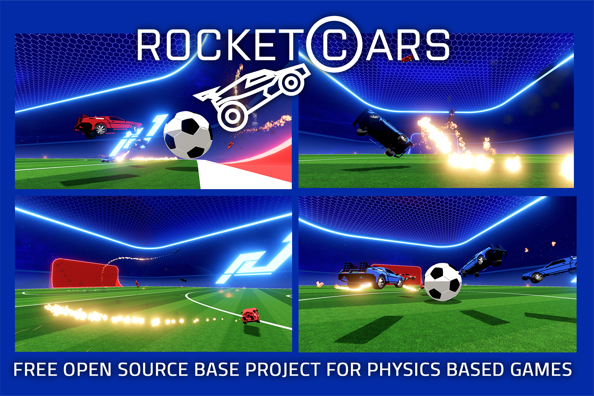

# Rocket Cars (Unity)

---

<figure><figcaption></figcaption></figure>

Rocket Cars is a free open-source server-authoritative physics-based multiplayer car game sample, inspired by Rocket League. 

## Features
- Clean and documented code 
- Fully server-authoritative simulation (cheating is impossible)
- Fully predicted physics for all cars and the ball
- Custom vehicle physics model, inspired by Rocket League
- Goal replay system
- Full-match replay mode (using Netick's built-in full-game replay system)
- Custom field shader
- Camera Effects
- In-Game Text Chat

## Download

https://github.com/NetickNetworking/NetickRocketCars