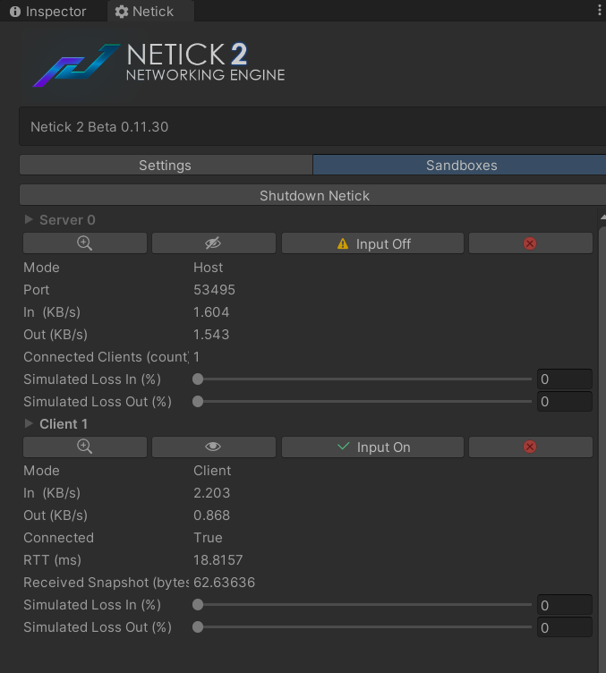

# Sandboxing

> [!Note]
> This page is still under construction

Sandboxing or can be known as multipeer, allow developers to start multiple simulations in a single instance for various purposes
- Saves both server and clients in your unity instance (or editor)
- Start multiple clients to join a single server
- Host multiple servers in a single instance

Sandboxing Management can be accessed from Netick > Settings > Sandboxes

<figure><figcaption></figcaption></figure>

Here are things to avoid while working with multipeer
- `static` are shared between peers, avoid using static if you are going to hold different value.
Another solution of static is attach that component to the `NetworkSandbox` prefab and you can get access it using `Sandbox.GetComponent<T>`

## How to start 
```cs
Network.StartAsMultiplePeers(...);
```

Here are the useful APIs while working for sandboxing
```cs

// If Camera is Active
Sandbox.IsVisible { get; }

// If Input is enabled
Sandbox.InputEnabled { get; }
```