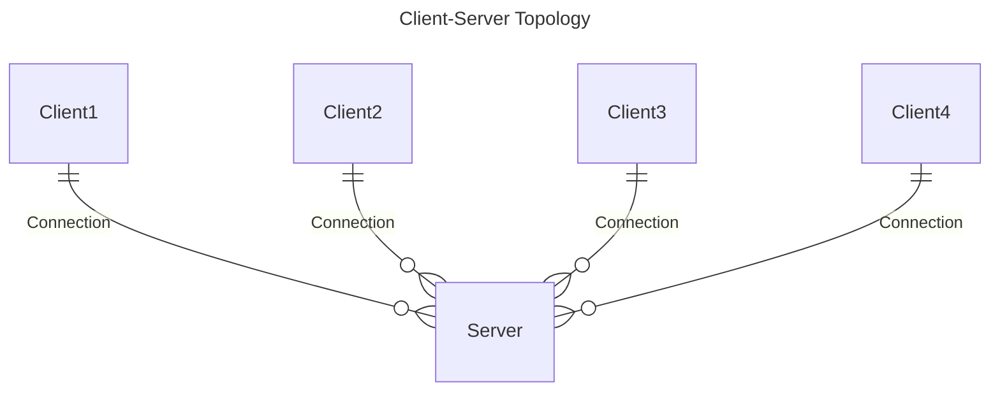

# Understanding Client-Server Model

When programming a single-player game, you usually don’t care about making sure the behavior and actions of players are legal, because it ultimately doesn’t matter since the game runs completely on their machine, and it’s impossible to prevent cheating when the client (player) has full access to everything related to the game. Because there is no central authority dictating the flow of the game, and enforcing the game rules and mechanics.

That’s why it’s extremely easy to cheat in peer-to-peer games (where every player is connected to everyone else and everyone can decide whatever they want). Each client can interpret the outcome of the game however it wants. This is the problem that the client-server model solves.

In this model, rather than connecting the players to each other, every player is simply connected to a single node/machine called the server. In a perfect client-server implementation, the client simply sends inputs (which describe what they want to happen, e.g. moving, shooting) and the server basically responds by sending back the resultant game state to that input. Therefore the server is the one who executes the inputs and so there is no way for the client to cheat.

Netick implements the client-server model + client-side prediction. You will see later how to construct these inputs and states to create your server-authoritative gameplay systems.
