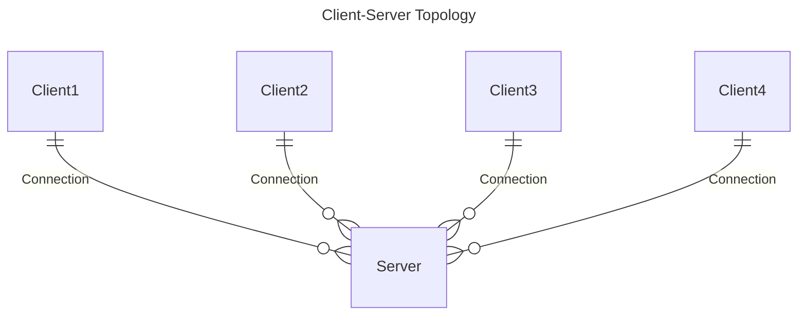

# Understanding Client-Server Model

---

In single-player games, developers typically don't need to enforce strict validation of player actions or behaviors. Since the game runs entirely on the player's local machine, preventing cheating isn't feasible—players have full access to all game data and logic. With no central authority to enforce the game’s rules and logic, any form of security or validation is effectively meaningless.

This challenge becomes more apparent in peer-to-peer multiplayer setups, where all players are directly connected to each other and can independently simulate the game. In such models, each client can interpret the game state differently, making cheating trivial and trust between peers difficult to maintain.

This is where the client-server model comes in.

Instead of connecting players to each other, each client connects to a single authoritative node: the server. In an ideal client-server setup, clients do not simulate gameplay on their own. Instead, they send input commands (e.g., movement, shooting) to the server. The server processes these inputs, updates the game state, and sends the results back to the clients.

Because the server is solely responsible for executing game logic, enforcing rules, and validating inputs, clients are unable to unilaterally alter the game. This architecture significantly reduces opportunities for cheating and ensures consistent gameplay across all clients.

Netick follows this model by implementing a server-authoritative architecture combined with client-side prediction. You’ll soon learn how to construct input and state systems to take full advantage of this approach and build secure, responsive multiplayer gameplay.
