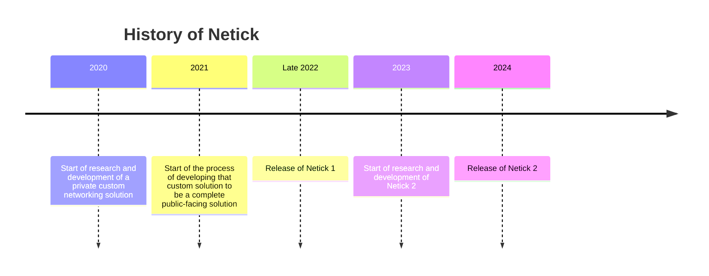

## Documentation

[Getting Started Guide](articles/getting-started-guide/0-overview.html)

[Manual](articles/understanding-client-server-model.html)

[API reference](api/index.html) 

<!-- 
## Getting Started

### Unity

> [!Video https://www.youtube.com/embed/QdFDaKai96E]

### Godot

> [!Video https://www.youtube.com/embed/eqDv8rPnYwk] -->

If you have any questions, requests, or anything, join our [discord](https://discord.com/invite/uV6bfG66Fx).

## Do you want to integrate your engine?

If you want a custom integration for your engine, contact at <support@netick.net>, <karsoftgames@gmail.com> or have a casual conversation in our discord.

## Donate

If you use and like Netick, consider supporting us to keep working and improving Netick!

[Donate](https://www.patreon.com/user?u=82493081)

<!-- ## Histroy of Netick

 -->
